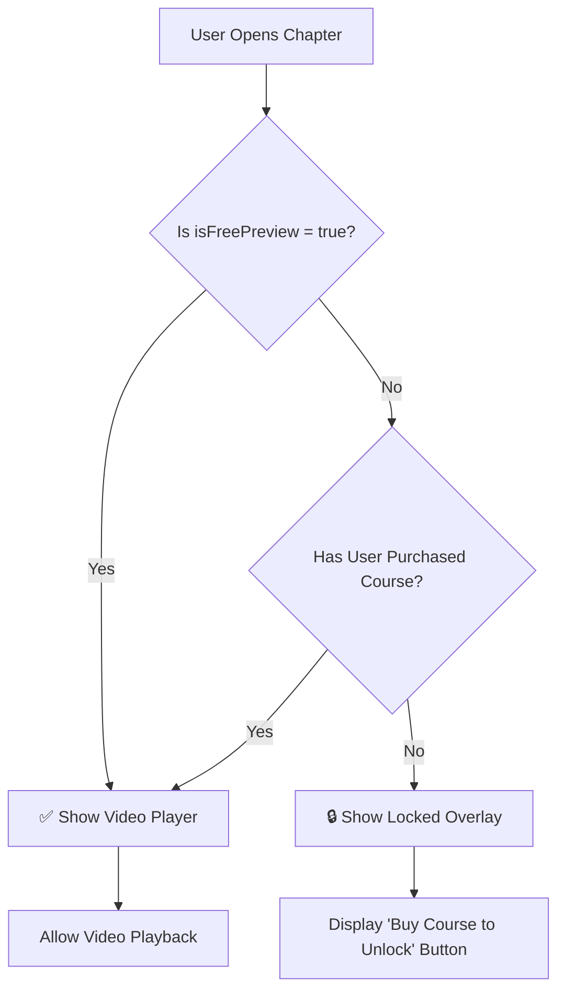

# CourseVideoPlayer Component - Documentation

## Overview
A React component that conditionally renders video content based on chapter preview status and user purchase status.

## Logic Flow



## Component Props

| Prop | Type | Description |
|------|------|-------------|
| `chapter` | `Chapter` | Current chapter object with video details |
| `courseName` | `string` | Name of the course for display in locked state |
| `coursePrice` | `string` | Price to display on purchase button |
| `hasPurchased` | `boolean` | Whether user has purchased the course |
| `onPurchaseClick` | `() => void` | Callback when purchase button is clicked |

## Chapter Interface

```typescript
interface Chapter {
  id: string;
  title: string;
  videoUrl: string;
  duration: string;
  isFreePreview: boolean;  // Key flag for access control
}
```

## Access Control Logic

### Condition 1: Free Preview
```typescript
if (chapter.isFreePreview === true) {
  // ✅ Render video player
  // Allow playback regardless of purchase status
}
```

### Condition 2: Premium Content - Not Purchased
```typescript
if (chapter.isFreePreview === false && hasPurchased === false) {
  // 🔒 Show locked overlay
  // Display: Lock icon, message, and "Buy Course to Unlock" button
}
```

### Condition 3: Premium Content - Purchased
```typescript
if (chapter.isFreePreview === false && hasPurchased === true) {
  // ✅ Render video player
  // Allow playback
}
```

## Usage Example

```tsx
import CourseVideoPlayer from '@/components/CourseVideoPlayer';

function CoursePage() {
  const [hasPurchased, setHasPurchased] = useState(false);
  
  const chapter = {
    id: "ch1",
    title: "Introduction to Limits",
    videoUrl: "/videos/limits.mp4",
    duration: "15:30",
    isFreePreview: true  // This chapter is free
  };

  return (
    <CourseVideoPlayer
      chapter={chapter}
      courseName="Calculus Mastery"
      coursePrice="399 MAD"
      hasPurchased={hasPurchased}
      onPurchaseClick={() => {
        // Handle purchase flow
        console.log('Redirect to checkout');
      }}
    />
  );
}
```

## Visual States

### 1. Free Preview (Unlocked)
- ✅ Play button visible
- Green "Free Preview" badge
- Full video playback enabled

### 2. Premium - Purchased (Unlocked)
- ✅ Play button visible
- Orange "Premium Content" badge
- Full video playback enabled

### 3. Premium - Not Purchased (Locked)
- 🔒 Lock icon overlay
- "Locked Content" message
- Course name and price displayed
- "Buy Course to Unlock" button with price
- Video controls hidden

## Styling Features

- **Glassmorphism effect** on locked overlay
- **Orange branding** (#FF6B00) for buttons and accents
- **Smooth transitions** between states
- **Responsive design** for all screen sizes

## Integration with Course Page

The component is used in [app/course/[id]/page.tsx](file:///c:/Users/amina/nova%20youssef/app/course/[id]/page.tsx) with:
- Chapter list sidebar
- Purchase status toggle (demo)
- Full course information display

## Testing

Use the demo toggle button on the course page to test both states:
- **Not Purchased**: See locked overlays on premium chapters
- **Purchased**: All chapters become accessible

## Production Considerations

1. **Remove demo toggle** in production build
2. **Connect to real authentication** system
3. **Integrate with payment gateway** for purchase flow
4. **Store purchase status** in database
5. **Add video analytics** for tracking engagement
